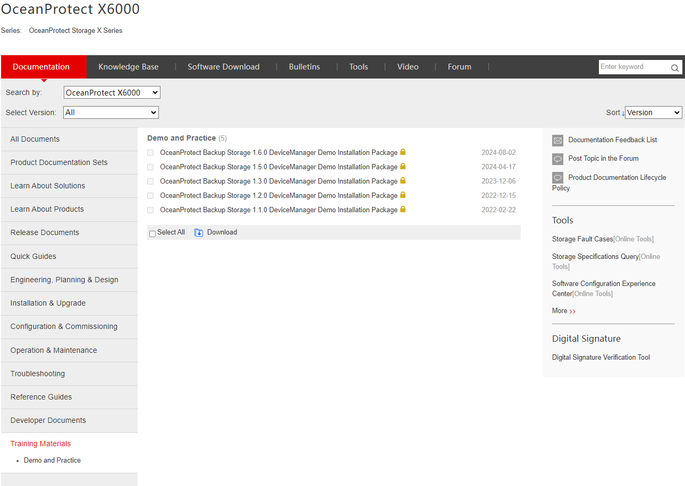

#### **Requisitos**

* Solución de Almacenamiento que el cliente necesita

---

#### **Tareas**

1. Ingresar a [Huawei Support](https://support.huawei.com/enterprise)
2. Buscar el **Modelo** de la Solución de Almacenamiento requerida
   
3. Ir a **Documentación** > **Materiales de Capacitación**
4. Descargar la **Demo** requerida correspondiente a la versión del cliente
   
5. Ejecutar el archivo ejecutable **start demo**
6. Ingresar a [https://localhost:8088](https://localhost:8088):

   * **Usuario** : admin
   * **Contraseña** : Admin@storage / Admin@Storage
