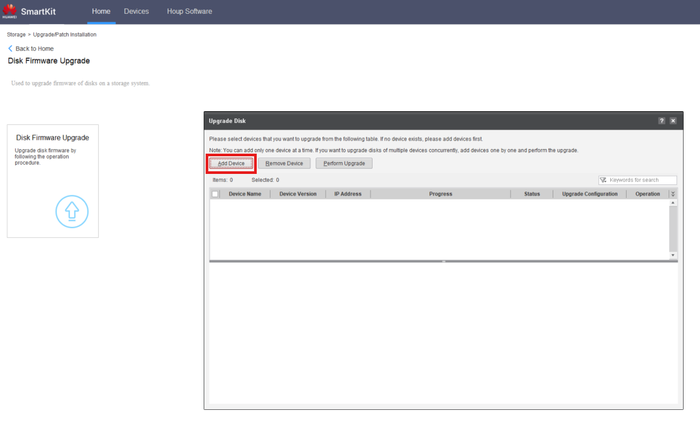

### **Requisitos**

* **Smart Kit** con todas las funciones instaladas
* **Firmware de disco** descargado

---

### **Tareas**

1. Abra el software **SmartKit**
2. Agregue el dispositivo si aún no está allí en **Dispositivos** >  **Agregar** :

   * **IP** : Use la IP de gestión del controlador
   * **Usuario** : admin
   * **Contraseña** : Contraseña de administrador (proporcionada por el cliente)

   
3. Vaya a **Instalación de actualización/parche** > **Más** > **Actualización de firmware de disco**
   
4. Haga clic en ' **Actualización de firmware de disco** '
   
5. Haga clic en ' **Agregar dispositivo** ' y seleccione los dispositivos de almacenamiento necesarios
   
6. Siga el proceso de actualización
