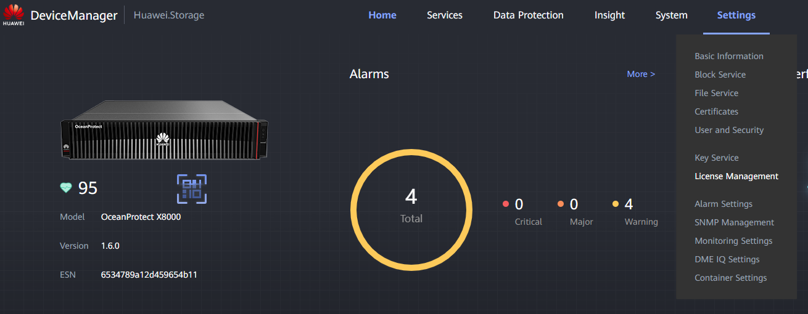
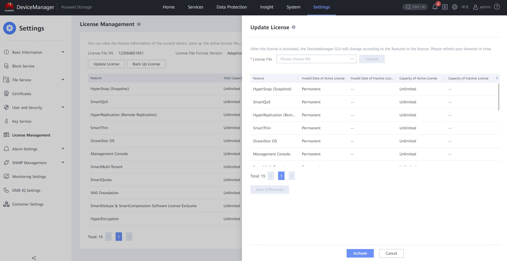

### **Requisitos**

* Conexión al **Controlador** a través del Puerto de Gestión (cable RJ45)
* **IP del Puerto de Gestión**
* Archivo de licencia (.dat) según las especificaciones del cliente

---

### **Tareas**

1. Ingrese al Administrador de Dispositivos ([https://192.168.128.101](https://192.168.128.101) o la IP del puerto)
2. Ingrese a **Configuración** > **Gestión de Licencias**
   
3. Haga clic en **Actualizar Licencia**
4. Elija el o los **Archivos de Licencia** (.dat) y haga clic en **Subir**
   
5. Haga clic en **Activar** para finalizar el proceso
