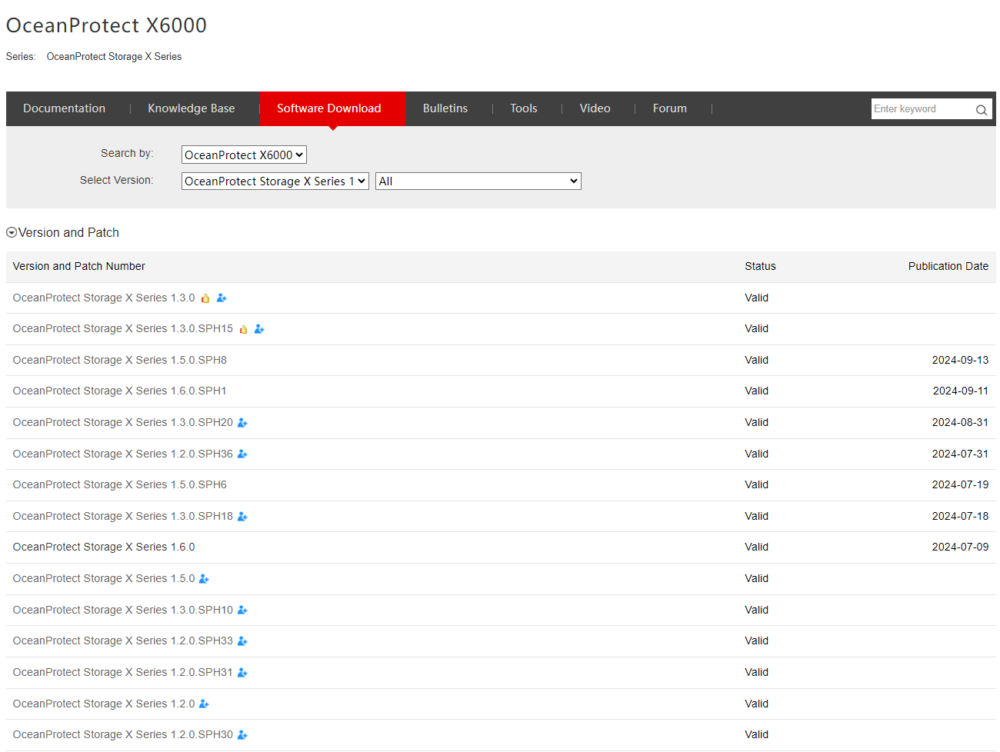

### **Descarga de Software**

#### Requisitos

* **Solución de almacenamiento** que el cliente necesita
* Versión de software requerida

---

#### Tareas

1. Ingrese a [https://support.huawei.com/enterprise/en/index.html](https://support.huawei.com/enterprise/en/index.html)
2. Busque el **Modelo** de la solución de almacenamiento requerida
   
3. Vaya a **Descarga de Software** y encuentre el software:

   * Principal: No tiene la extensión .SPHXX
   * Parche: El número más alto en SPHXX para el parche principal requerido
4. Haga clic en **Descargar** y complete los detalles requeridos (si es necesario)
   
5. Espere la aprobación (si está bloqueado) y descargue el software
