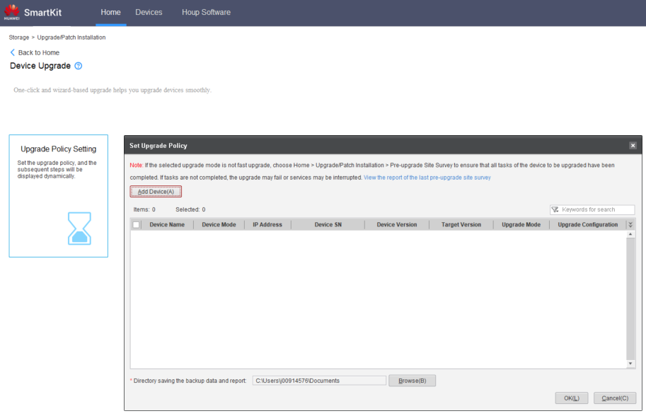

### **Smart Kit**

#### Requisitos

* **Smart Kit** con todas las funciones instaladas: [Descargar SmartKit](https://support.huawei.com/enterprise/en/distributed-storage/smartkit-pid-8576706/software/261548176?idAbsPath=fixnode01%7C7919749%7C251366268%7C250389224%7C251366263%7C8576706)
* **Software Principal** y **Parche** descargados: [Descargar Software Principal y Parche](../Storage%20Cabinets%20Configuration/Main%20and%20Patch%20Software%20Download.md)
* **IPs de gestión** de los **Controladores** (proporcionados por el cliente)
* Cable **Ethernet** (RJ45) para la conexión

---

#### Tareas

1. Conecte al **Controlador** a través del cable RJ45
2. Abra el software **SmartKit**
3. Agregue el dispositivo si aún no está allí en **Dispositivos** >  **Agregar** :

   * **IP** : Use la IP de gestión del controlador
   * **Usuario** : admin
   * **Contraseña** : Contraseña de administrador (proporcionada por el cliente)

   
4. Vaya a **Instalación de actualización/parche** > **Actualización de dispositivo** > **Configuración de política de actualización**
5. Seleccione el **Dispositivo** a actualizar
   
6. Seleccione **Actualizar dispositivo de almacenamiento**
7. Navegue para encontrar el archivo de **Actualización principal** y presione **Finalizar**
8. Haga clic en **Modificar** para seleccionar el **Parche** después de que termine la **Actualización principal**
9. Haga clic en **OK** para iniciar la **Actualización del dispositivo**

---

### **Administrador de dispositivos**

#### Requisitos

* **Software Principal** y **Parche** descargados de la solución de almacenamiento requerida
* **IPs de gestión** de los **Controladores** (proporcionados por el cliente)
* **Archivo de licencia** para la **Solución de Almacenamiento** requerida
* Cable **Ethernet** (RJ45) para la conexión

---

#### Tareas

1. Conecte al **Controlador** a través del cable RJ45
2. Abra **Administrador de dispositivos** ([https://192.168.128.101](https://192.168.128.101) o la IP del puerto) > **Configuración** > **Información básica** > **Actualización**
3. Haga clic en el botón de **Actualización manual** para iniciar el proceso
4. Para  **Actualización de parche** :

   1. Haga clic en **Parche rápido**
   2. Verifique que la **Versión actual** sea correcta
   3. Desmarque **Actualizar componente de paquete de verificación**
   4. Paquete de parche: Busque el **Archivo de actualización** y haga clic en **Subir**
   5. Haga clic en **Actualizar**
5. Para  **Actualización principal** :

   1. Haga clic en **Actualización del sistema**
   2. Verifique que la **Versión actual** sea diferente de la que se actualizará
   3. Desmarque **Actualizar componente de paquete de verificación** y haga clic en **Evaluar**
   4. Después de que termine el proceso, cargue el **Archivo de licencia** y haga clic en **Siguiente**
